1.新建项目 
 
选择Spring Initializr 
选择默认default选项 
点击Next 
 
 
在Artifact中命名 
点击Next 
 
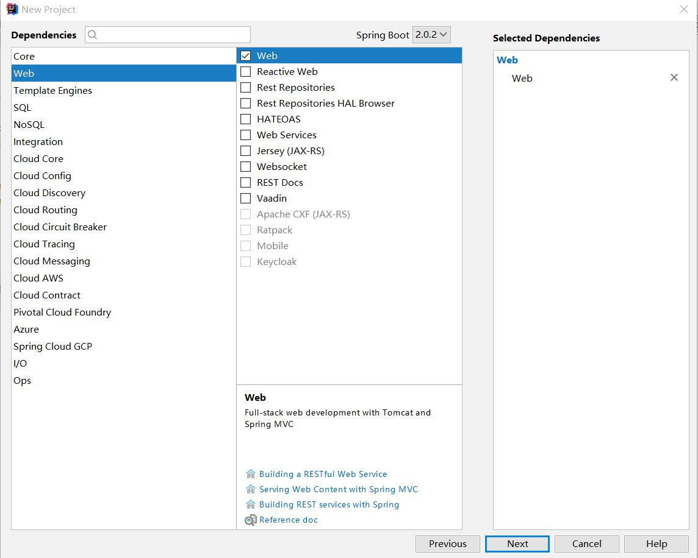 
在web中选择web 
 
 
在SQL中选择JPA和MySQL 
点击Next后新建项目 
 
2.配置数据库 
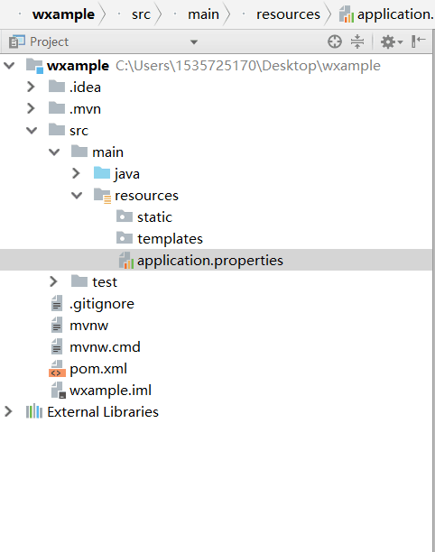 
将下载的hibernate.cfg.xml和application.properties放置在以下目录，并覆盖目录中原有的application.properties 
src\main\resources 
 
修改application.properties中的数据库名,username和password(不宜观看) 
 
 
修改hibernate.cfg.xml中的数据库名（我的数据库名为webpj） 
 
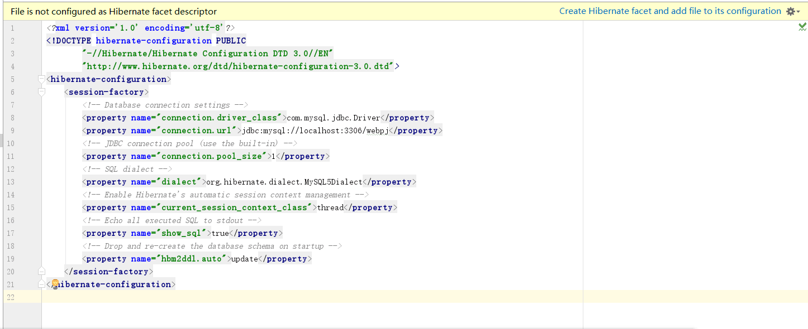 
点击右上角Create Hibernate facet... 
 
菜单栏->View->Tool Windows->Database 
 
点击图中加号“+“ -> Data Source -> MySQL
 
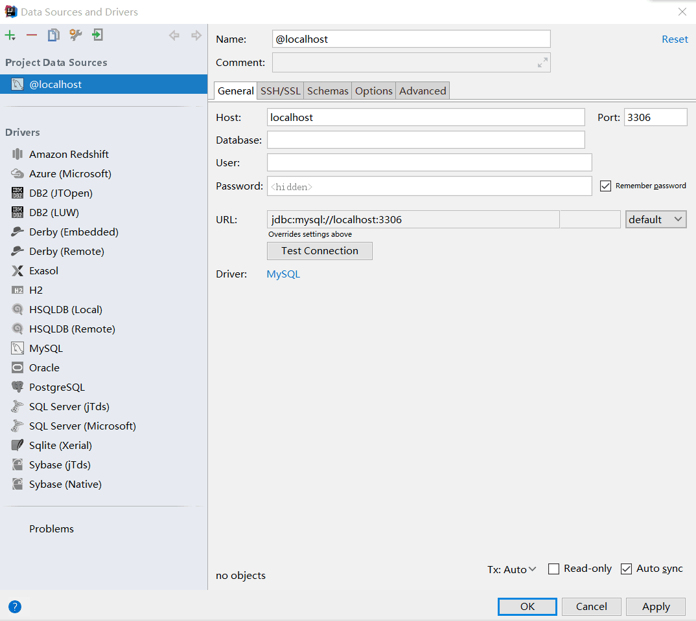 
输入Database,User和Password，点击Test Connection 
提示success后点击OK 
 
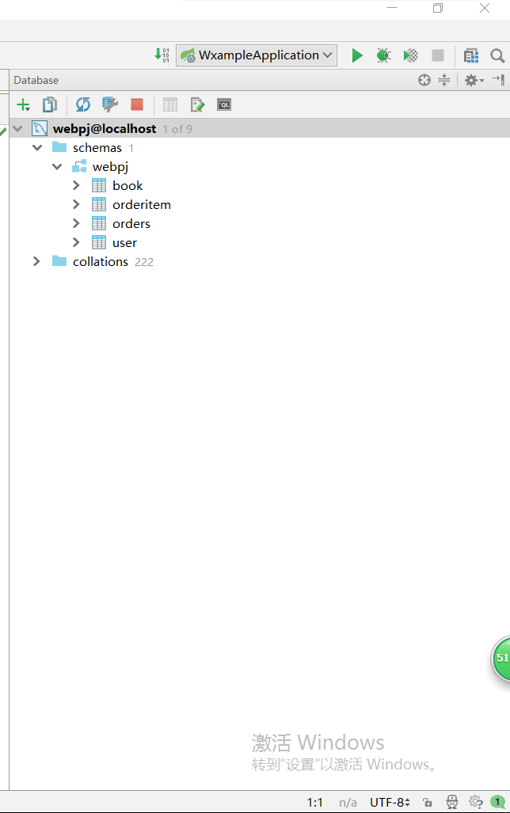 
右侧出现数据库信息 
在以下路径（src\main\java.com.example.你的项目名）新建文件夹(文件夹指的是Package) model，用来安置数据库对应的实体类 
菜单栏View->Tool Windows -> Persistence 
 
 
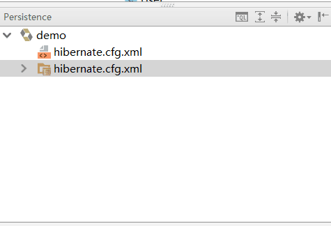 
此处右键 -> Generate Persistence Mapping ->By DataBase Schema 
 
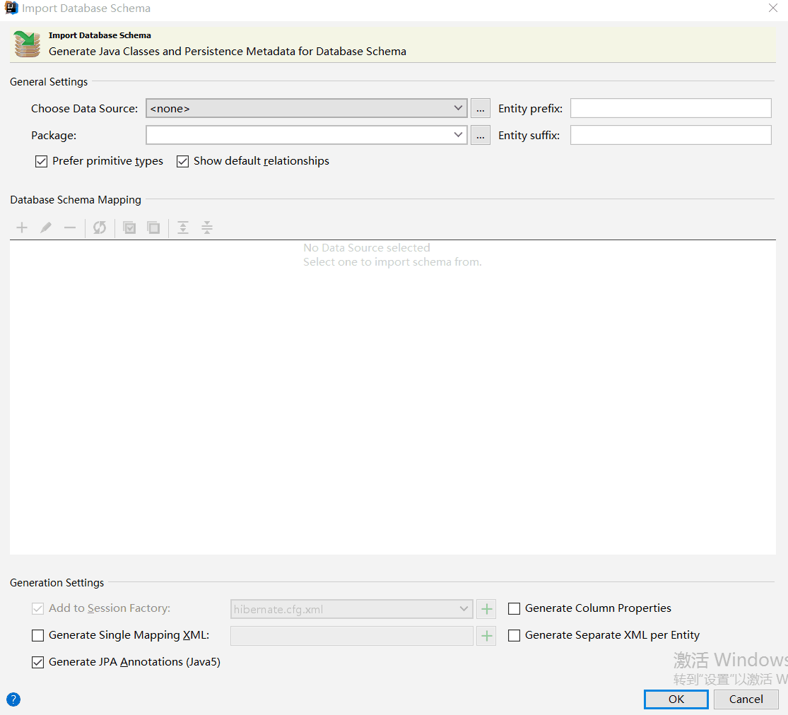 
Choose Data Source的选项中有刚刚设置的数据库，选之 
Package中手动选择刚刚新建的model处路径 
选中表中所有属性（展开看） 
 
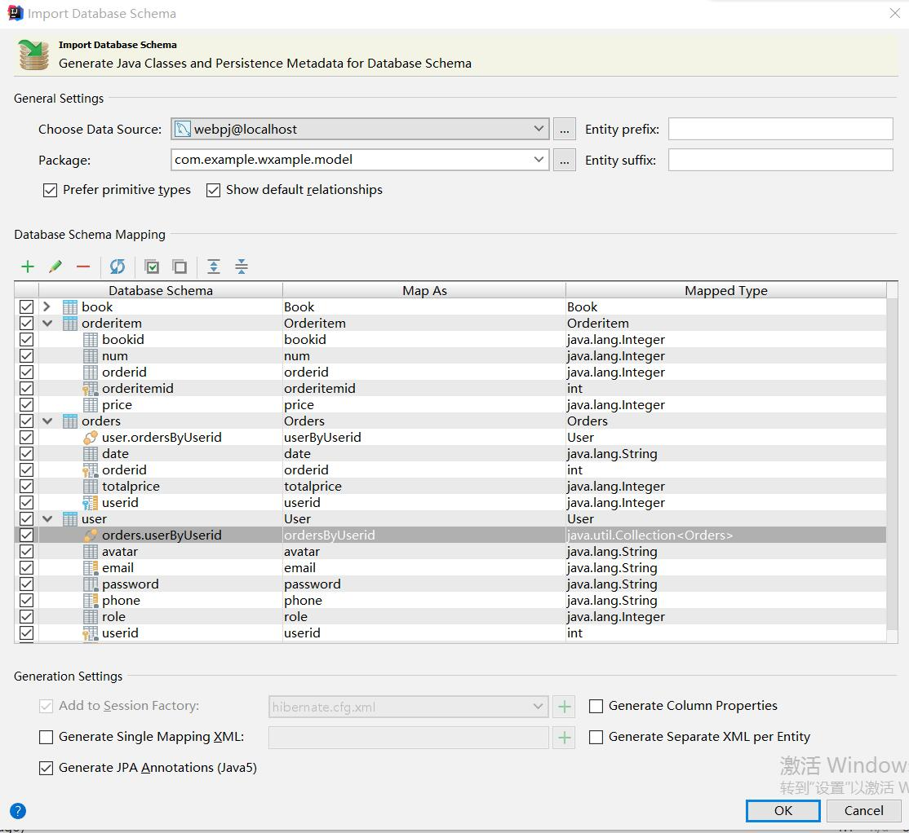 
点击OK 
在model文件夹下可以看到自动生成的类 
 
3.配置后端 
在以下路径（src\main\java.com.example.你的项目名）新建文件夹(文件夹指的是Package) Config，放置下载的文件CorsConfig，用于跨域访问，需要改动飘红的文件路径（不需要改动) 
 
接下来以book为例，写一个get方法： 
在以下路径（src\main\java.com.example.你的项目名）新建文件夹(文件夹指的是Package) DAO，在里面新建一个BookRepository类,在代码中改变其为接口，并且extends JpaRepository<Book,Integer>，其中Integer不能改变，是和数据库中表的id相关，这样每次save的时候id都是自动分配的（因此id需要改成int类型） 
如下： 
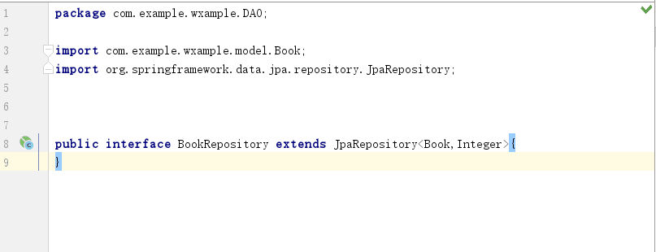 
 
在以下路径（src\main\java.com.example.你的项目名）新建文件夹(文件夹指的是Package) Service，在里面新建一个BookService类,在代码中改变其为接口.在这里声明之后要用的自定义函数 
如下: 
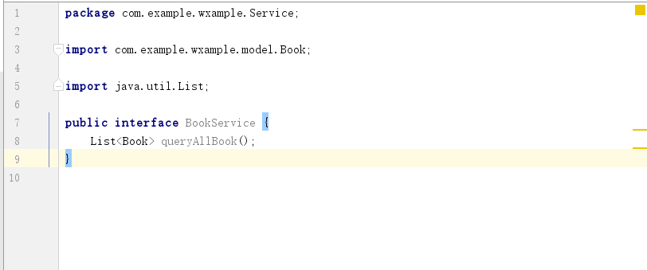 
 
在以下 （注意这里的路径！） 路径（src\main\java.com.example.你的项目名\Service）新建文件夹(文件夹指的是Package) ServiceImpl，在里面新建一个BookServiceImpl类,在这里定义之前在BookService中声明的函数 
为其添加注解@Service并且实现BookService类 
有个BookRepository类的成员，为其添加@Autowired实现自动装配 
用注解Override来复写之前在BookService中声明的函数，可以用很多BookRepository中自动实现的函数，如findById之类的
如下: 
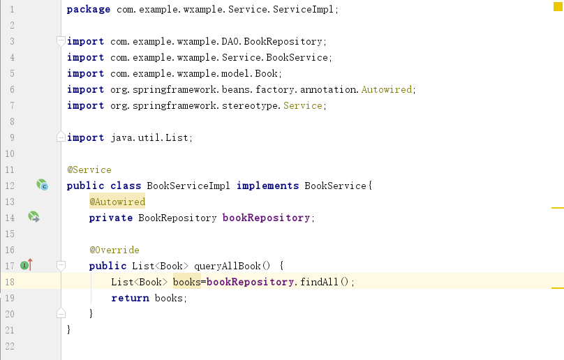 
 
在以下路径（src\main\java.com.example.你的项目名）新建文件夹(文件夹指的是Package) Controller，在里面新建一个BookController类,用于接收前端发来的请求 
为其添加注解@Controller 
有个BookService类的成员，为其添加@Autowired实现自动装配 
以图中形式实现处理请求的函数,如果请求带有参数，将GetMapping注解改为PostMapping注解，在函数中添加类似为@RequestParam("bookname") String bookname的参数（后见前端发送post请求的格式） 
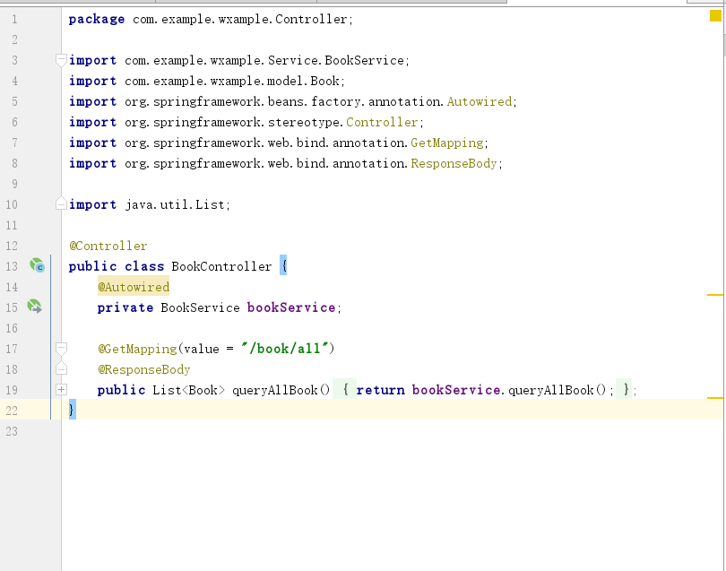 
 
点击运行，打开网页http://localhost:8080/book/all（/book/all对应于BookController中处理事务的地址）
 
 
4.前端使用 
首先要在前端的项目目录下 npm install jquery --save 
在使用时先 import $ from 'jquery' 
 
用法如图，和前面写的后端相对应。函数中在用后端的response做点事 
 
 

最后，简单展示一下post情况下的前后端（后端bookService中的函数需要自己实现，如上文示范）: 
前端： 
在用前端之前首先要改变前端的port端口，使之不能与后端端口一样 
第一个参数是访问地址，第二个参数是map键值对，键是和后端获取时对应的，值是前端代码中的变量，第三个参数是得到后端返回值后进行操作的函数 
 
 
后端： 
有特定的格式接受参数，注意键要与前端传过来的对应 
 
 
(还有一种得到参数和写回的方法与web作业第二次迭代相同,用HttpServlet。图如下：) 
 
 

